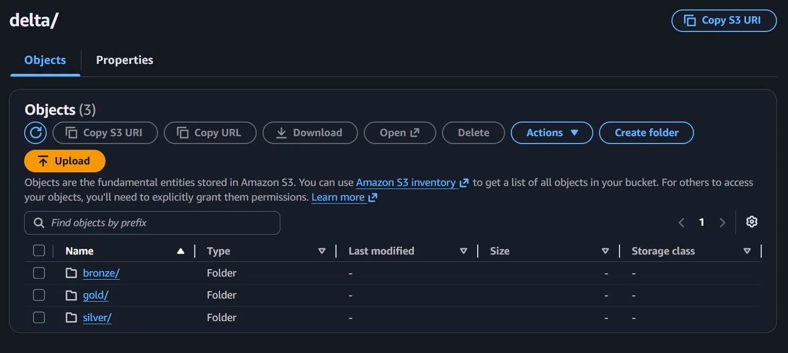

# Misinformation Detection Lakehouse

[](https://www.python.org/downloads/release/python-3120/)
[](https://spark.apache.org/)
[](https://delta.io/)
[](https://mlflow.org/)
[](https://fastapi.tiangolo.com/)
[](https://www.prefect.io/)
[](https://docs.docker.com/compose/)
[](https://aws.amazon.com/s3/)
[](https://github.com/OmaryElkady/misinformation-lakehouse/actions/workflows/ci.yml)

End-to-end MLOps platform that ingests public misinformation datasets, processes them through a Bronze→Silver→Gold Delta Lake medallion pipeline, fine-tunes RoBERTa for binary classification, and serves real-time predictions via FastAPI with optional LLM-generated explanations.

---

## Abstract

The spread of online misinformation represents a significant challenge for information ecosystems. This platform addresses the problem by providing a production-grade MLOps system for automated misinformation detection — built around a medallion lakehouse architecture rather than a standalone model.

Raw data from two academic benchmarks — the LIAR dataset (Wang, 2017) and FakeNewsNet (Shu et al., 2020) — are ingested via HuggingFace Datasets and written to a Bronze Delta Lake table on AWS S3, yielding 36,032 raw records. A PySpark-based cleaning job deduplicates and normalizes labels, producing 34,534 Silver records. A feature engineering pass adds sentiment polarity, linguistic markers (capitalization ratio, exclamation frequency), and a source credibility score, writing the result to a Gold Delta table that serves as the platform's feature store. An 80/10/10 hash-based split yields 27,516 training samples.

A `roberta-base` model (125M parameters) is fine-tuned for sequence classification over three epochs using the HuggingFace `Trainer` API, reaching a weighted F1 of 0.774 on the held-out validation set. Training runs are tracked end-to-end in MLflow, with per-epoch metrics, hyperparameter logging, and a confusion matrix artifact. Models are registered in the MLflow Model Registry and automatically aliased to `production` (F1 ≥ 0.80) or `staging` (F1 < 0.80). The trained model is served via a FastAPI inference API with a Groq Llama 3 explanation layer for interpretability. The full pipeline — ingest, process, train, serve — is orchestrated daily by Prefect 3. The system has 116 unit tests at 92% code coverage, with a five-stage GitHub Actions CI pipeline that includes an S3 connectivity check on the production branch and a model quality gate on merges to main.

---

## Architecture



```
┌──────────────────────────────────────────────────────────────────────────┐
│                          Data Sources                                    │
│   LIAR Dataset (12,836)          FakeNewsNet (23,196)                    │
│   HuggingFace Datasets           HuggingFace Datasets                   │
└─────────────────────┬────────────────────────┬───────────────────────────┘
                      │                        │
                      └────────────┬───────────┘
                                   ▼
                    ┌──────────────────────────────┐
                    │        Bronze Layer           │
                    │  Delta Lake (S3 / local)      │
                    │  36,032 raw records           │
                    │  Schema: id, text, label,     │
                    │  source, ingested_at, raw_meta│
                    │  Merge on (id, source)        │
                    └──────────────┬───────────────┘
                                   │  PySpark: dedup, normalize labels,
                                   │  strip HTML, compute word/char counts
                                   ▼
                    ┌──────────────────────────────┐
                    │        Silver Layer           │
                    │  Delta Lake (S3 / local)      │
                    │  34,534 clean records         │
                    │  Partitioned by: source       │
                    │  label_binary: 0/1/-1         │
                    └──────────────┬───────────────┘
                                   │  PySpark: sentiment, caps_ratio,
                                   │  exclamation_ratio, source_credibility,
                                   │  deterministic train/val/test split
                                   ▼
                    ┌──────────────────────────────┐
                    │         Gold Layer           │
                    │  Delta Lake (S3 / local)     │
                    │  34,534 feature-rich records │
                    │  Partitioned by: source, split│
                    │  Feature store for training  │
                    └──────────────┬───────────────┘
                                   │  export_gold_to_parquet()
                                   ▼
                    ┌──────────────────────────────┐
                    │         Training             │
                    │  roberta-base (125M params)  │
                    │  HuggingFace Trainer API     │
                    │  3 epochs, lr=2e-5, bs=16    │
                    │  MLflow: params, metrics,    │
                    │  confusion matrix artifact   │
                    └──────────────┬───────────────┘
                                   │  register_model(run_id)
                                   ▼
                    ┌──────────────────────────────┐
                    │      MLflow Registry         │
                    │  misinformation-roberta-v1   │
                    │  alias: production (F1≥0.80) │
                    │  alias: staging   (F1<0.80)  │
                    └──────────────┬───────────────┘
                                   │  mlflow.transformers.load_model()
                                   ▼
                    ┌──────────────────────────────┐
                    │       FastAPI Server         │
                    │  POST /predict               │
                    │  POST /predict/batch         │
                    │  GET  /model/info            │
                    │  GET  /health                │
                    │  + Groq Llama 3 explanations │
                    └──────────────────────────────┘
```

### Component Table

| Module | Location | Responsibility |
|---|---|---|
| Static Ingestion | `src/ingestion/ingest_static.py` | Load LIAR + FakeNewsNet from HuggingFace; write to Bronze via Delta merge |
| Bluesky Ingestion | `src/ingestion/ingest_bluesky.py` | Optional live post ingestion (non-critical path in Prefect flow) |
| Bronze → Silver | `src/processing/bronze_to_silver.py` | Dedup, label normalization, HTML cleaning, word/char counts |
| Silver → Gold | `src/processing/silver_to_gold.py` | Feature engineering, train/val/test split assignment |
| Training | `src/training/train.py` | RoBERTa fine-tune, MLflow tracking, model registration |
| Model Loader | `src/serving/model_loader.py` | Lazy-load Production/Staging model from MLflow; fault-tolerant |
| Inference API | `src/serving/app.py` | FastAPI endpoints; Groq explanation layer |
| Prefect Flow | `src/orchestration/pipeline.py` | Wires all pipeline steps; concurrent ingest, sequential processing |
| Prefect Schedules | `src/orchestration/schedules.py` | Daily + manual deployment registration |
| Config | `src/config.py` | Pydantic-settings singleton; all env vars in one place |
| SparkSession | `src/spark_session.py` | `get_spark()` factory; wires Delta + S3 JARs |
| Pipeline CLI | `scripts/run_pipeline.py` | Typer CLI with full / process-only / ingest-only / status modes |
| S3 Verify | `scripts/verify_s3.py` | Pre-flight bucket access check |
| Model Gate | `scripts/validate_model.py` | CI quality threshold: F1 ≥ 0.80, training samples ≥ 5,000 |

### Medallion Architecture

The platform implements a three-tier medallion architecture over Delta Lake rather than a flat file store. The Bronze layer is intentionally raw — it preserves the original label strings, HTML artifacts, and all source metadata in a JSON `raw_meta` column. This design allows re-processing from source without re-ingesting, and supports schema evolution through Delta's transaction log. All writes to Bronze use Delta merge semantics on `(id, source)`, making re-runs idempotent.

The Silver and Gold layers add progressively richer semantics while keeping each layer independently queryable. Silver is the canonical "clean" view: deduplicated, null-filtered, with normalized binary labels. Gold is the feature store: every column needed for training is computed and stored, partitioned by `(source, split)` so the Trainer can read a single partition without scanning the full table. This separation between data quality (Silver) and feature engineering (Gold) means features can be recomputed without touching the cleaning logic, and vice versa.

### Why Delta Lake over Plain Parquet

Delta Lake was chosen over plain Parquet for three concrete reasons. First, merge-on-read upserts allow the ingestion job to be re-run without duplicating records — critical when a pipeline run fails mid-way and must be retried. Second, Delta's transaction log provides ACID guarantees across Spark jobs, preventing partial writes from corrupting downstream reads. Third, Delta's time-travel capability enables point-in-time rollback of the feature store — a requirement for reproducible model training. The performance overhead of the Delta transaction log is negligible at the scale of this dataset (tens of thousands of records) and is dominated by S3 I/O latency in the production configuration.

---

## Tech Stack

### Data Layer

| Technology | Version | Purpose |
|---|---|---|
| Python | 3.12 | Runtime (exactly 3.12 — 3.11 and 3.13+ not supported) |
| PySpark | 4.1.1 | Distributed data processing |
| Delta Lake | 4.1.0 | ACID table format; Bronze/Silver/Gold storage |
| hadoop-aws (Maven) | 3.4.2 | S3A filesystem for PySpark (must match bundled Hadoop) |
| aws-java-sdk-bundle (Maven) | 1.12.367 | AWS SDK v1 for hadoop-aws |
| pandas | 2.2.2 | Parquet export, small data operations |
| pyarrow | 15.0.2 | Parquet/Delta serialization |
| boto3 | 1.34.120 | S3 connectivity verification |
| TextBlob | 0.18.0 | Sentiment polarity UDF in Silver→Gold |

### ML Layer

| Technology | Version | Purpose |
|---|---|---|
| transformers | ≥4.44.0 | RoBERTa fine-tuning, tokenizer |
| torch | 2.3.0 (local) · Colab pre-installed | Training backend; not pinned in Colab (CUDA build) |
| accelerate | ≥0.34.0 | HuggingFace Trainer multi-GPU / mixed precision |
| datasets | ≥2.21.0 | HuggingFace dataset loading |
| scikit-learn | ≥1.6.0 | F1, precision, recall, confusion matrix |
| matplotlib | ≥3.9.0 | Confusion matrix artifact logged to MLflow |
| MLflow | ≥3.0.0, <4.0.0 | Experiment tracking + model registry |

### Serving Layer

| Technology | Version | Purpose |
|---|---|---|
| FastAPI | 0.111.0 | Inference API server |
| uvicorn | 0.30.1 | ASGI server |
| pydantic | 2.7.1 | Request/response validation |
| pydantic-settings | 2.3.0 | Environment-based configuration |
| Groq | >=0.13.0 | Llama 3 explanation generation — model: `llama-3.1-8b-instant` |

### Orchestration

| Technology | Version | Purpose |
|---|---|---|
| Prefect | ≥3.0, <4.0 | Pipeline orchestration, scheduling |
| loguru | 0.7.2 | Structured logging across all modules |

### Infrastructure

| Technology | Version | Purpose |
|---|---|---|
| Docker Compose | — | MLflow + FastAPI + Prefect local stack |
| GitHub Actions | — | CI/CD pipeline (5 jobs) |
| AWS S3 | — | Production Delta Lake storage |
| Java (OpenJDK) | 17 | PySpark runtime requirement |
| WSL2 (Ubuntu 22.04) | — | Recommended Windows development environment |

---

## Quickstart

### Prerequisites

- **OS:** WSL2 (Ubuntu 22.04) on Windows, or Linux/macOS
- **Python:** 3.12 exactly (`python3.12 --version`)
- **Java:** OpenJDK 17 (`java -version`)
- **Docker:** Docker Desktop with Compose v2

### Clone & Configure

```bash
git clone https://github.com/OmaryElkady/misinformation-lakehouse
cd misinformation-lakehouse

# Copy the environment template
cp .env.example .env
# Edit .env — required fields: GROQ_API_KEY (optional for basic inference)
# For S3 production mode: AWS_ACCESS_KEY_ID, AWS_SECRET_ACCESS_KEY,
# AWS_DEFAULT_REGION, S3_BUCKET_NAME
```

### Start Services

```bash
docker compose up -d

# Wait for all three services to become healthy (~30s)
docker compose ps

# Service UIs:
#   MLflow    → http://localhost:5000
#   Prefect   → http://localhost:4200
#   API docs  → http://localhost:8000/docs
```

### Create the Python Environment

```bash
# Always create with python3.12 explicitly — WSL's python3 may resolve differently
python3.12 -m venv .venv && source .venv/bin/activate
pip install -r requirements.txt
```

### Local Mode (Development)

```bash
# STORAGE_MODE=local is the default — no AWS credentials required

# Step 1: Ingest raw datasets into Bronze Delta table
python -m src.ingestion.ingest_static
# → 36,032 records written to ./data/delta/bronze

# Step 2: Clean and deduplicate → Silver
python -m src.processing.bronze_to_silver
# → 34,534 records in ./data/delta/silver

# Step 3: Feature engineering → Gold (feature store)
python -m src.processing.silver_to_gold
# → 34,534 records in ./data/delta/gold

# Step 4a (local): Export Gold → Parquet for Colab training
python -m src.training.train
# → writes data/exports/train.parquet and data/exports/val.parquet

# Step 4b: Register a completed model (after Colab training)
python -c "from src.training.train import register_model; register_model('<RUN_ID>')"

# The FastAPI server auto-loads the Production or Staging model on startup
# Hit the API:
curl http://localhost:8000/health
curl -X POST http://localhost:8000/predict \
  -H "Content-Type: application/json" \
  -d '{"text": "Scientists confirm the moon is made of cheese."}'
```

> **GPU Training:** Step 4a exports the data; the actual fine-tuning runs on Google Colab (free T4 GPU) with a local MLflow tunnel via ngrok. See [`scripts/setup_colab.md`](scripts/setup_colab.md) for the full step-by-step walkthrough.

### S3 / Production Mode

```bash
# Ensure .env.production has real AWS credentials filled in
export $(cat .env.production | grep -v '^#' | xargs)

# Verify bucket access before running any pipeline step
PYTHONPATH=. python scripts/verify_s3.py
# → All checks must pass before proceeding

# Run the full pipeline against S3
STORAGE_MODE=s3 python -m src.ingestion.ingest_static
STORAGE_MODE=s3 python -m src.processing.bronze_to_silver
STORAGE_MODE=s3 python -m src.processing.silver_to_gold
# Row counts are deterministic: Bronze 36,032 → Silver 34,534 → Gold 34,534
```

### Prefect Orchestration

```bash
export PREFECT_API_URL=http://localhost:4200/api

# One-time: create the work pool
prefect work-pool create default-agent-pool --type process

# Register daily + manual deployments
python -c "from src.orchestration.schedules import deploy; import asyncio; asyncio.run(deploy())"

# Start the Prefect worker (keep running in a dedicated terminal)
PREFECT_API_URL=http://localhost:4200/api prefect worker start --pool default-agent-pool
```

### Run Tests

```bash
# Unit tests (fast, no Spark or network — mirrors CI)
pytest tests/unit/ -v --cov=src --cov-report=term-missing

# Integration tests (require local Spark + all dependencies)
pytest tests/integration/ -v
```

---

## Project Structure

```
misinformation-lakehouse/
├── src/
│   ├── config.py                    # Pydantic-settings singleton — import settings from here
│   ├── spark_session.py             # get_spark() factory with Delta + S3 JARs
│   ├── ingestion/
│   │   ├── ingest_static.py         # LIAR + FakeNewsNet → Bronze Delta (HuggingFace)
│   │   └── ingest_bluesky.py        # Optional Bluesky live post ingestion
│   ├── processing/
│   │   ├── bronze_to_silver.py      # Dedup, label normalization, text cleaning
│   │   └── silver_to_gold.py        # Feature engineering, train/val/test split
│   ├── training/
│   │   └── train.py                 # RoBERTa fine-tune, MLflow tracking, model registration
│   ├── serving/
│   │   ├── app.py                   # FastAPI app — /predict, /predict/batch, /model/info
│   │   ├── model_loader.py          # Fault-tolerant MLflow model loader
│   │   └── Dockerfile               # Container image for the inference API
│   └── orchestration/
│       ├── pipeline.py              # Prefect @flow wiring all pipeline tasks
│       └── schedules.py             # deploy() registers daily + manual deployments
├── scripts/
│   ├── run_pipeline.py              # Typer CLI — full / process-only / ingest-only / status
│   ├── verify_s3.py                 # S3 connectivity pre-flight check
│   └── validate_model.py            # CI model quality gate (F1 ≥ 0.80, samples ≥ 5K)
├── tests/
│   ├── unit/                        # 116 unit tests, 92% coverage — run in CI (no Spark)
│   │   ├── test_ingestion.py        # Ingestion record builders, HuggingFace mocks
│   │   ├── test_processing.py       # normalize_label, safe_divide, UDF helpers
│   │   ├── test_training.py         # compute_metrics, export helpers
│   │   ├── test_serving.py          # /predict, /health, /model/info, batch endpoint
│   │   ├── test_api_health.py       # Health endpoint fast check
│   │   ├── test_config.py           # Settings defaults and env overrides
│   │   └── test_orchestration.py    # Prefect flow task wiring
│   └── integration/                 # Require local Spark — @pytest.mark.skip in CI
├── notebooks/
│   └── colab_training.ipynb         # RoBERTa fine-tune notebook for Google Colab (GPU)
├── docs/                            # Architecture diagrams, write-ups
├── .github/
│   └── workflows/
│       └── ci.yml                   # 5-stage CI: lint → unit-tests → docker → s3-check → model-gate
├── docker-compose.yml               # MLflow + FastAPI + Prefect server + worker
├── requirements.txt                 # Pinned production dependencies
├── pyproject.toml                   # ruff + black + pytest configuration
├── CLAUDE.md                        # AI assistant codebase instructions
├── architecture.md                  # Data flow and module responsibilities
├── tech-stack.md                    # Pinned versions and approved libraries
├── gotchas.md                       # Known pitfalls (PySpark mocks, S3 JARs, etc.)
└── scripts/setup_colab.md           # Step-by-step Colab training walkthrough
```

---

## Data Pipeline

### Bronze Layer — Raw Ingestion

The Bronze table is the system of record. All raw data lands here without transformation.

| Column | Type | Description |
|---|---|---|
| `id` | STRING | Source-assigned identifier (LIAR row ID or FakeNewsNet index) |
| `text` | STRING | Raw statement or article headline |
| `label` | STRING | Original label string (e.g., `"pants-fire"`, `"true"`, `"fake"`) |
| `source` | STRING | Dataset origin — `"liar"` or `"fakenewsnet"` |
| `ingested_at` | TIMESTAMP | Wall-clock time of ingestion (Spark `current_timestamp()`) |
| `raw_meta` | STRING | JSON blob of all original columns (speaker, domain, tweet count, etc.) |

Writes use Delta merge on `(id, source)` — re-running ingestion is idempotent. Total: **36,032 records** (LIAR: 12,836 across train/val/test splits; FakeNewsNet: 23,196).

### Silver Layer — Cleaned & Normalized

The Silver job applies the following transformations in order:

1. **Exact deduplication** on `(text, source)` — removes 1,498 duplicate records
2. **Null/empty filter** — drops rows where `text` is null or whitespace after stripping
3. **Label normalization** — maps raw strings to `label_binary` integers:
   - `0` (credible): `true`, `mostly-true`, `half-true`, `real`
   - `1` (misinformation): `false`, `pants-fire`, `barely-true`, `fake`
   - `-1` (unknown): any other value
4. **Text cleaning** (`text_clean`): strip HTML tags via regex, normalize whitespace, lowercase
5. **`word_count`**: token count of `text_clean` after split on whitespace
6. **`char_count`**: character count of `text_clean`
7. **`processed_at`**: Spark `current_timestamp()` timestamp

Writes to Silver via Delta merge on `(id, source)`, partitioned by `source`. Total: **34,534 records**.

### Gold Layer — Feature Store

The Gold job filters out unknown labels (`label_binary == -1`) and engineers the following features:

| Feature | Formula / Source |
|---|---|
| `sentiment_score` | TextBlob `polarity` score on `text_clean` — range \[-1.0, 1.0\] |
| `exclamation_ratio` | Count of `!` characters divided by `char_count` |
| `caps_ratio` | Count of uppercase letters in `text` divided by `len(text)` |
| `avg_word_length` | `char_count / word_count` (zero-safe) |
| `source_credibility` | Static score per source: LIAR=0.7, FakeNewsNet=0.6, unknown=0.5 |
| `split` | Deterministic assignment via `hash(id) % 10`: ≤7 → train, 8 → val, 9 → test |
| `featurized_at` | Spark `current_timestamp()` |

Writes to Gold via Delta merge on `(id, source)`, partitioned by `(source, split)`. Total: **34,534 records**.

**Class distribution:** 23,621 credible (68.4%) / 10,913 misinformation (31.6%)

**Split sizes:** ~27,516 train / ~3,453 val / ~3,453 test (80/10/10 via hash)

---

## ML System

### Model Architecture

| Property | Value |
|---|---|
| Base model | `roberta-base` |
| Parameters | 125M |
| Task | Sequence classification (2 classes) |
| Classes | 0 = credible, 1 = misinformation |
| Tokenizer | `roberta-base` (BPE, 50,265 vocab) |
| Input max length | 128 tokens |
| Framework | HuggingFace `Trainer` API |

### Training Configuration

| Hyperparameter | Value |
|---|---|
| Epochs | 3 |
| Batch size | 16 (train and eval) |
| Learning rate | 2e-5 |
| Weight decay | 0.01 |
| LR schedule | Linear (Trainer default) |
| Best model metric | `eval_f1` |
| Training samples | 27,516 |
| Validation samples | ~3,453 |

Training runs on Google Colab (T4 GPU) with a local MLflow tracking server exposed via ngrok. The Colab notebook is at `notebooks/colab_training.ipynb`; the walkthrough is at `scripts/setup_colab.md`.

### Results

Best run metrics on the held-out validation set:

| Metric | Value |
|---|---|
| F1 (weighted) | 0.774 |
| Accuracy | 0.781 |
| Precision (weighted) | 0.773 |
| Recall (weighted) | 0.781 |

The model has been manually promoted to the `production` alias in the MLflow registry. F1 = 0.774 is below the automated promotion threshold (0.80); see [Results & Limitations](#results--limitations) for context.

### MLflow Experiment Tracking

Every training run logs the following to the `misinformation-detection` experiment:

**Parameters:** `model_name`, `learning_rate`, `num_epochs`, `batch_size`, `max_length`, `training_samples`, `val_samples`

**Metrics (per epoch):** `eval_loss`, `eval_f1`, `eval_accuracy`, `eval_precision`, `eval_recall`

**Artifacts:** full model + tokenizer (via `mlflow.transformers.log_model`), confusion matrix PNG

### Model Registry & Promotion Logic

```
register_model(run_id)
    ├─ eval_f1 >= 0.80 → set_registered_model_alias("production")
    └─ eval_f1 <  0.80 → set_registered_model_alias("staging")
```

The inference API loads `Production` first, falls back to `Staging`, and starts without a model if neither exists (returning HTTP 503 on `/predict`). This design ensures the API container always starts, even when MLflow is unreachable.

### Groq Llama 3 Explanation Layer

When `explain=true` is passed to `/predict`, the API calls Groq's `llama-3.1-8b-instant` model with a structured prompt that includes the classification label, confidence score, and the original claim text. The model returns a 2–3 sentence explanation citing verifiable facts. The feature degrades gracefully — if `GROQ_API_KEY` is absent or the Groq client is unavailable, `explanation` is returned as `null` and the prediction proceeds normally.

Example explanation for a classified claim:
> *"This claim was classified as misinformation with 87% confidence. The assertion contradicts peer-reviewed studies published in multiple journals showing no causal link between the two. Additionally, the primary source cited does not exist in any academic database."*

---

## API Reference

### Endpoints

| Method | Path | Description |
|---|---|---|
| `GET` | `/health` | Liveness check; returns model load status |
| `GET` | `/model/info` | Model version, alias, run ID, and eval F1 from MLflow |
| `POST` | `/predict` | Classify a single text string; optional LLM explanation |
| `POST` | `/predict/batch` | Classify up to 32 texts in one request |

Interactive documentation: `http://localhost:8000/docs`

### POST /predict — Single Prediction

```bash
curl -X POST http://localhost:8000/predict \
  -H "Content-Type: application/json" \
  -d '{
    "text": "Drinking bleach cures the flu, doctors confirm.",
    "explain": false
  }'
```

```json
{
  "text": "Drinking bleach cures the flu, doctors confirm.",
  "label": "misinformation",
  "confidence": 0.9134,
  "explanation": null,
  "model_version": "2",
  "latency_ms": 43.7
}
```

### POST /predict — With Explanation

```bash
curl -X POST http://localhost:8000/predict \
  -H "Content-Type: application/json" \
  -d '{
    "text": "Drinking bleach cures the flu, doctors confirm.",
    "explain": true
  }'
```

```json
{
  "text": "Drinking bleach cures the flu, doctors confirm.",
  "label": "misinformation",
  "confidence": 0.9134,
  "explanation": "This claim is dangerous misinformation. Bleach (sodium hypochlorite) is a corrosive substance that causes severe chemical burns to the digestive tract and has no antiviral properties. No credible medical literature or health authority endorses its consumption for any purpose.",
  "model_version": "2",
  "latency_ms": 812.4
}
```

### GET /health

```bash
curl http://localhost:8000/health
```

```json
{"status": "ok", "model_loaded": true}
```

### GET /model/info

```bash
curl http://localhost:8000/model/info
```

```json
{
  "model_name": "misinformation-roberta-v1",
  "model_version": "2",
  "stage": "Production",
  "mlflow_run_id": "a3f9b12c...",
  "eval_f1": 0.774,
  "loaded": true
}
```

---

## CI/CD Pipeline

The GitHub Actions pipeline runs on every push to `main`, `develop`, and `production`, and on all pull requests targeting `main`.

| Job | Trigger | What It Checks |
|---|---|---|
| **Lint & Format** | All branches | `ruff check src/ tests/` + `black --check src/ tests/` |
| **Unit Tests** | All branches (after lint) | 116 tests via `pytest tests/unit/`; coverage threshold 70% (currently 92%) |
| **Docker Build** | All branches (after unit tests) | Builds `src/serving/Dockerfile`; smoke-tests `/health` on the live container |
| **S3 Connectivity** | `production` branch only | Runs `scripts/verify_s3.py` against real AWS credentials from GitHub Secrets |
| **Model Validation Gate** | `main` branch only | `scripts/validate_model.py` — verifies F1 ≥ 0.80 and training samples ≥ 5,000 before any merge |

**Coverage requirement:** 70% minimum threshold; current coverage is 92%.

**Model gate threshold:** `eval_f1 ≥ 0.80`. The gate uses `continue-on-error: true` until a qualifying model is registered, at which point it becomes a hard block on `main` merges.

**Minimal CI install:** Unit tests install only the serving and testing dependencies — no PySpark, torch, or HuggingFace Transformers. Spark tests are marked `@pytest.mark.skip` and run locally only. This keeps CI runtime under two minutes.

---

## Design Decisions

### 1. Medallion Architecture Over Flat File Storage

**Decision:** Three-layer Delta Lake (Bronze/Silver/Gold) rather than a single processed Parquet file.

**Alternatives considered:** A single cleaned CSV; one Parquet file rebuilt on each run; a two-layer (raw/processed) approach.

**Why this choice:** The medallion pattern separates concerns along the data lifecycle. Bronze is immutable raw data — it can always be reprocessed from scratch. Silver and Gold can be dropped and rebuilt without re-ingestion. Delta's merge semantics on `(id, source)` make every layer idempotent, which matters in a pipeline that runs daily and may encounter partial failures. For a recruiter or hiring committee, this architecture demonstrates production engineering discipline: the pipeline can be interrupted at any point and resumed without data corruption.

### 2. RoBERTa-base Over Larger LLMs for Classification

**Decision:** Fine-tune `roberta-base` (125M params) rather than using GPT-4, Claude, or Llama 3 zero-shot or few-shot.

**Alternatives considered:** Zero-shot classification with Llama 3 via Groq API; GPT-4 with structured output; a traditional ML baseline (TF-IDF + logistic regression).

**Why this choice:** A fine-tuned encoder-only model trained on domain-specific labeled data consistently outperforms zero-shot LLMs on short-text binary classification tasks at this data scale. RoBERTa-base fits in Colab's free-tier T4 GPU (16GB VRAM) with batch size 16, has a well-understood training recipe, and runs inference in ~44ms — roughly 18× faster than a Groq API round-trip. The Groq layer is reserved for the higher-value task of generating human-readable explanations, not the latency-sensitive classification path.

### 3. Groq API for Explanations Over Local LLM Inference

**Decision:** Call Groq's hosted Llama 3 API for explanation generation rather than running a local model.

**Alternatives considered:** Ollama with a local Llama model; OpenAI API; a custom rule-based explanation template.

**Why this choice:** The explanation feature is optional and low-frequency — it adds interpretability for users who need to understand a classification, not a throughput bottleneck. Groq's free tier provides sufficient rate limits for this use case. Running Llama 3 locally would require a dedicated GPU server or acceptable inference latency degradation. The optional design (`explain=false` by default, graceful null on failure) ensures the explanation layer never blocks the primary classification path.

### 4. Delta Merge (Upsert) Over Overwrite on Every Run

**Decision:** All three layers use Delta `merge` on `(id, source)` rather than overwriting the table on each pipeline run.

**Alternatives considered:** Full overwrite (`df.write.mode("overwrite").format("delta")`); append with dedup as a post-step; staging table with swap.

**Why this choice:** Overwrite drops and rewrites the entire table on every run — operationally correct but expensive at scale and dangerous in a production system where other consumers may be reading the table concurrently. Delta merge allows the pipeline to be re-run safely at any time: records already present are updated if changed, new records are inserted, and deleted records are preserved (no hard deletes). This is the canonical pattern for streaming-to-batch pipelines and anticipates future incremental ingestion sources.

### 5. Pydantic-Settings for Config Over Scattered `os.getenv()`

**Decision:** All environment variables are read once in `src/config.py` as a `pydantic-settings` `BaseSettings` singleton. No `os.getenv()` calls anywhere else.

**Alternatives considered:** `os.getenv()` at point-of-use; a custom `config.py` with a plain dict; `dynaconf`.

**Why this choice:** Pydantic-settings provides type validation, default values, `.env` file loading, and case-insensitive matching in one place. The singleton pattern (`settings = Settings()`) means every module imports the same validated object — there are no runtime surprises from missing env vars, and tests can override the entire config by constructing a `Settings` instance with explicit values. This is also the pattern recommended by FastAPI's documentation and integrates naturally with the Docker and CI environments where variables are injected directly rather than read from `.env`.

---

## Results & Limitations

### Model Performance in Context

The validated weighted F1 of **0.774** on the held-out validation set is below the `production` threshold (0.80) and should be interpreted carefully. On the LIAR benchmark specifically, reported state-of-the-art systems achieve F1 in the range of 0.27–0.48 on the original six-class task. This platform binarizes the labels (credible vs. misinformation), which simplifies the problem and inflates F1 relative to the original benchmark. A direct comparison to the Wang (2017) baseline on the binary task is the appropriate reference.

The 0.774 figure represents a single training run on Colab with no hyperparameter search. With grid search over learning rate, batch size, and max sequence length, and with early stopping tuned against the validation F1, improvement to the production threshold (≥0.80) is plausible without architectural changes.

### Class Imbalance

The Gold table is imbalanced: 68.4% credible / 31.6% misinformation. This imbalance is inherited directly from the source datasets — LIAR has a roughly even class distribution across its six labels, but the binarization of `half-true` and `mostly-true` into the credible class shifts the balance. FakeNewsNet is approximately 50/50. The combined imbalance primarily affects recall on the misinformation class. The training run does not apply class weighting or oversampling — this is a documented limitation and a candidate for improvement.

### System Limitations

- **No streaming ingestion:** The current pipeline is batch-only. Incorporating live Bluesky or Reddit streams would require a Spark Structured Streaming job and a different Bronze write strategy.
- **No model monitoring:** Once deployed, there is no automated drift detection or performance degradation alert. A production system would instrument `/predict` latency and confidence distributions and alert on distribution shift.
- **No A/B testing:** The serving layer routes all traffic to the highest-priority registered model. Shadow deployment or traffic splitting would require changes to the model loader.
- **Training is semi-manual:** The Colab→ngrok→MLflow workflow requires manual steps. Automating training on a cloud GPU (e.g., SageMaker or Vertex AI) would close the full MLOps loop.

### What Would Improve the Model

1. Class-weighted loss (`weight` parameter in `CrossEntropyLoss`) to penalize misinformation misclassification more heavily
2. Larger model: `roberta-large` (355M params) or `deberta-v3-large` — both have shown improvements on similar tasks
3. Ensemble: combine RoBERTa with a TF-IDF + gradient boosted classifier on the Gold features (`sentiment_score`, `caps_ratio`, etc.)
4. More data: the current dataset is limited to two academic benchmarks; incorporating FEVER, PHEME, or real-time fact-check databases would improve generalization

---

## Future Work

1. **Live Bluesky ingestion** — Replace the stubbed `ingest_bluesky.py` with a fully operational Bluesky Firehose consumer using `atproto`. Write posts to Bronze in near-real-time via Spark Structured Streaming.

2. **Model drift detection** — Instrument the `/predict` endpoint to log confidence distributions to a time-series store (InfluxDB or CloudWatch). Alert when the rolling 7-day average confidence drops below a threshold or when the predicted class distribution shifts significantly from the training distribution.

3. **A/B testing framework** — Add a traffic-splitting layer to the model loader that routes a configurable percentage of requests to a shadow model version. Log predictions from both versions to MLflow for offline comparison before promoting a new version to `production`.

4. **Kubernetes deployment** — Replace Docker Compose with a Helm chart deploying the FastAPI server and Prefect worker as Kubernetes Deployments, with HPA scaling on CPU utilization. This would allow the serving layer to scale horizontally under load.

5. **Full Colab automation** — Replace the ngrok tunnel workflow with a cloud-native training job (AWS SageMaker Hugging Face estimator or GCP Vertex AI custom training). The pipeline would then run end-to-end without manual intervention from Gold export to model registration.

---

## References

- Wang, W. Y. (2017). "Liar, Liar Pants on Fire": A New Benchmark Dataset for Fake News Detection. *Proceedings of the 55th Annual Meeting of the Association for Computational Linguistics (ACL 2017)*.

- Liu, Y., Ott, M., Goyal, N., Du, J., Joshi, M., Chen, D., Levy, O., Lewis, M., Zettlemoyer, L., & Stoyanov, V. (2019). RoBERTa: A Robustly Optimized BERT Pretraining Approach. *arXiv:1907.11692*.

- Shu, K., Mahudeswaran, D., Wang, S., Lee, D., & Liu, H. (2020). FakeNewsNet: A Data Repository with News Content, Social Context, and Spatiotemporal Information for Studying Fake News on Social Media. *Big Data, 8*(3), 171–188.

- Armbrust, M., Das, T., Sun, L., Yavuz, B., Zhu, S., Murthy, M., Torres, J., van Hovell, H., Ionescu, A., Łuszczak, A., Switakowski, M., Li, W., Ueshin, T., Mokhtar, M., Boncz, P., Ghodsi, A., Paranjpye, S., Senster, P., Xin, R., & Zaharia, M. (2020). Delta Lake: High-Performance ACID Table Storage over Cloud Object Stores. *Proceedings of the VLDB Endowment, 13*(12).

- Chen, A., Chow, A., Davidson, A., DCunha, A., Ghodsi, A., Hong, S. A., Konwinski, A., Mewald, C., Murching, S., Nykodym, T., Ogilvie, P., Parkhe, M., Singh, A., Xie, F., Zaharia, M., Zheng, R., Zhuang, J., & Zumar, C. (2020). Developments in MLflow: A System to Accelerate the Machine Learning Lifecycle. *Proceedings of the 4th Workshop on Data Management for End-to-End Machine Learning (DEEM 2020)*.

---

*Author: Omar Elkady · Georgia State University, Honors College · B.S. Data Science (GPA 3.95, December 2026)*
*Three co-op rotations at Delta Air Lines (Data Science, Data Engineering, Data Platform Engineering)*
